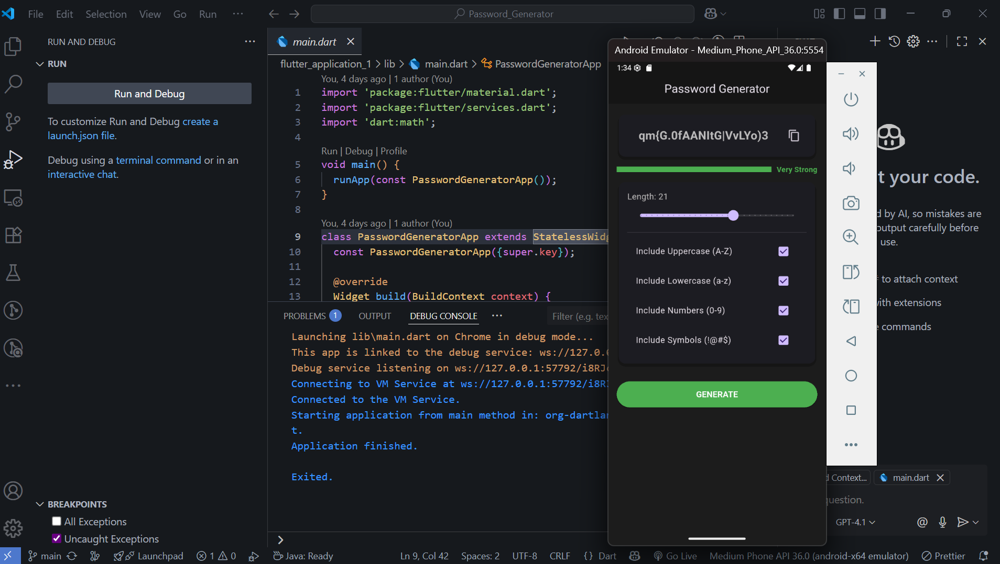
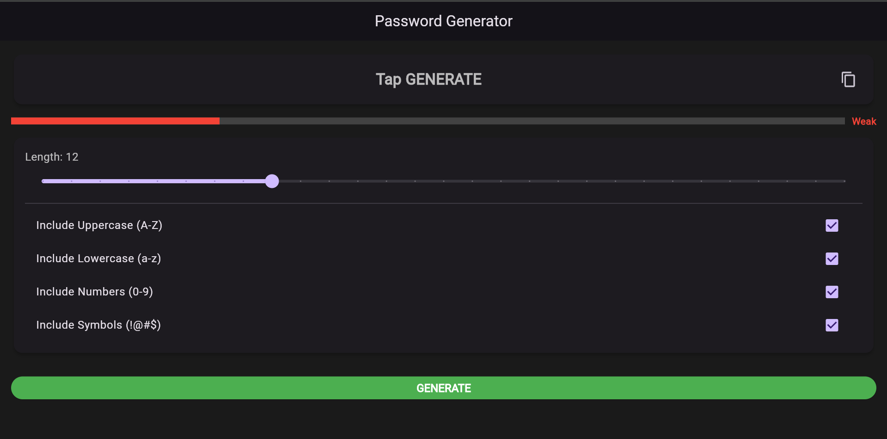

# Flutter Password Generator 🔐


A simple, secure, and cross-platform password generator application built with Flutter.

## 📖 Description
This is a user-friendly tool for creating strong, random passwords. The app provides a clean interface for customizing password criteria, including length and character types. It was built using the Flutter framework, allowing it to run on Android, iOS, and the web from a single codebase.

## ✨ Features
-   **Adjustable Length**: Easily set the password length using a slider (from 4 to 32 characters).
-   **Character Types**: Choose to include uppercase letters, lowercase letters, numbers, and symbols.
-   **Secure Generation**: Uses Dart's `Random.secure()` for cryptographically strong random values.
-   **Strength Indicator**: Visual feedback on the generated password's strength (Weak, Medium, Strong, Very Strong).
-   **Copy to Clipboard**: Instantly copy the generated password with a single tap.

## 🛠️ Installation
To get a local copy up and running, follow these simple steps.

1.  Clone the repository:
    ```bash
    git clone https://github.com/poly-30/Password_Generator
    ```
2.  Navigate to the project directory:
    ```bash
    cd Password_Generator
    ```
3.  Install dependencies:
    ```bash
    flutter pub get
    ```

## 🚀 Usage
After installation, you can run the app on your connected device, emulator, or web browser.

1.  Make sure you have a device running or have a browser like Chrome available.
2.  Run the application using the following command:
    ```bash
    flutter run
    ```

## 🤝 Contributing
Contributions are what make the open-source community such an amazing place to learn, inspire, and create. Any contributions you make are **greatly appreciated**.

1.  Fork the Project
2.  Create your Feature Branch (`git checkout -b feature/AmazingFeature`)
3.  Commit your Changes (`git commit -m 'Add some AmazingFeature'`)
4.  Push to the Branch (`git push origin feature/AmazingFeature`)
5.  Open a Pull Request

## 📧 Contact
Your Name - [@rk_poly](https://twitter.com/rk_poly) - myselfpoly01@gmail.com

Project Link: [https://github.com/poly-30/Password_Generator](https://github.com/poly-30/Password_Generator)

## Screenshots

Here's a preview of the Password Generator app in action:

**Android View**
--------------------------



**Web View**
----------------------

